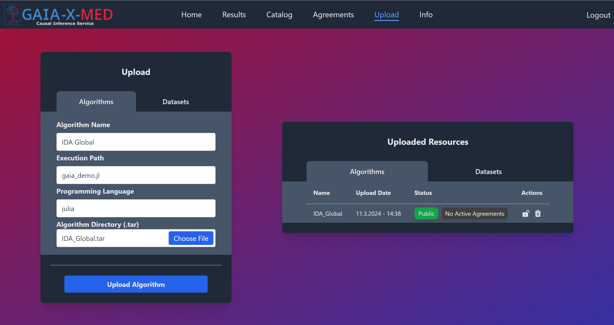
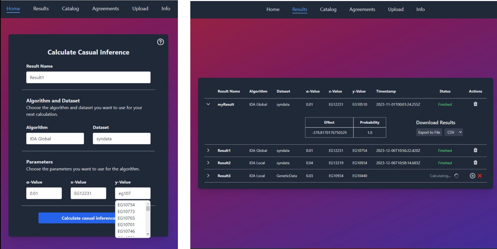

# Causal Inference Service

## Description
The Causal Inference Service is part of the Gaia-X-Med ecosystem and offers a platform for exchanging and using algorithms on datasets. These resources can be uploaded by so called resource providers. Subsequently, resource consumers can browse a catalog to find suitable algorithms or datasets and request them from the respective resource provider. If a request is accepted, an agreement is formed, ensuring that resource consumers have the right to use a resource for a specified period. The algorithms and datasets can then be executed directely on the server to perform calculations without the resources ever leaving the server. For demonstration purposes, the service currently only supports the uploading and execution of causal algorithms with input parameters x,y, and alpha. However, from a technical perspective, the service has the capability to support a diverse range of algorithms in the future.

The architecture of the service allows to upload algorithms in multiple programming language. Currently, the supported programming languages include:
- Julia
- Python
- R


## Requirements
Make sure you have Docker (Docker Compose) installed. You can download and install Docker from [here](https://www.docker.com/get-started).


## Installation 
To set up the service, follow these steps:

1) Navigate to the Service-Provider directory.
2) Execute the following command:
    ```
    docker compose up --build
    ```
Once the setup is complete, you can access the service at the following URL:

http://localhost:8001/

## Troubleshooting 
If your application launches but remains unreachable, it may indicate an issue with Keycloak. Keycloak utilizes the host.docker.internal endpoint to direct both the OIDC client (which operates within a container) and your browser to the Keycloak instance exposed on your localhost. Ensure that your container runtime supports this endpoint. You may need to include this endpoint in your operating system's hosts file to route it to your localhost.

1) Locate the hosts file at:
    - Windows: ``C:\Windows\System32\drivers\etc``
    - Linux: ``/etc/hosts``

2) Add the following lines:
    ```
    127.0.0.1 host.docker.internal
    127.0.0.1 gateway.docker.internal
    ```

## Usage


### Login
The service uses OpenID Connect to authenticate users. In this demo version of the service, the identity provider is mocked using [Keycloak](https://www.keycloak.org/). Two users have already been created: ``alice`` and ``bob``. Their passwords are the same as their usernames. Login with Alice to follow the example.

Note: In the live version of the service, the identity provider is provided by the ecosystem.

### Create a contract
Before Alice can utilize the service, a contract must be created authorizing Alice to use the service. The contract specifies whether a user of the service has the rights of a resource provider, a resource consumer, or both.

Use [curl](https://curl.se/) (or a similar tool) to create a contract for Alice that grants her full access to the application (both resource provider and resource consumer roles):

```
curl -X PUT "http://localhost:8002/contracts?participant=did:web:identity.gaia-med.org:demo:alice&service=www.domain.com%3Aservices%3AcausalInference&isProvider=true&isConsumer=true"
```

Afterward, Alice is authorized to use the entire application (You may have to refresh the page).

### Upload an algorithm
When logged in with Alice you can now upload your first algorithm. To do this, navigate to the [Upload Seite](http://localhost:8001/#/upload) and fill in the following details:
1) **Algorithm Name**: Choose a name for your algorithm
2) **Execution Path**: Specify the file that should be executed to start the algorithm (subpaths are also supported, e.g., "subDir/fileToExecute.py"). In this example, you can enter ``gaia_demo.jl``.
3) **Programming Language**: Select the programming language of the algorithm (in this case, Julia).
4) **Algorithm Directory**: Upload your algorithm as a tar directory (explained in detail below). For now, simply upload ``IDA_Global.tar`` from the directory ``demo_resources/algorithms/causalInferenceGlobal (julia)``

After clicking the upload button, the algorithm will be uploaded to the server. The server then downloads all the required dependencies of the algorithm, which can take a long time. Once the algorithm is processed, it will appear on the right-hand side.


### Upload a dataset
Next, Alice needs to upload a dataset. It must be in CSV format and contain data suitable for calculating causal effects. A synthetic gene dataset can be found in the directory ``demo_resources/datasets``.

### Start a calculation
You can now start your first calculation by selecting the uploaded algorithm and dataset on the [home screen](http://localhost:8001/#/). Additionally, you will have to give your result a name and specify the parameters you wish to use for the calculation. 

Note: alpha should be betweeen 0.001 and 1, while x and y depend on the uploaded dataset


Once the calculation is complete, you can view and download the result on the [results page](http://localhost:8001/#/results).

### Create another contract for Bob
It is also possbile to request algorithms and datasets from other resource providers instead of uploading them yourself. To demonstrate this functionality, create a second contract for bob, granting him the rights of a resource consumer:
```
curl -X PUT "http://localhost:8002/contracts?participant=did:web:identity.gaia-med.org:demo:bob&service=www.domain.com%3Aservices%3AcausalInference&isProvider=false&isConsumer=true"
```
Note: Bob can only access the Home, Result, and Catalog Page since he is not a resource provider and cannot upload resources.

### Request resources
Log in with Bob (you can log out with Alice or use a new private browser window). Navigate to the [Catalog Page](http://localhost:8001/#/catalog) and request the resources previously uploaded by Alice. Resources can only be requested for a specified period of time. Make sure to request both the algorithm and the dataset from Alice for at least an hour.

### Agreements
Before Bob can utilize the resources for his own calculations, Alice must accept the requests. Accepting a request forms an agreement between Bob and Alice, allowing Bob to use the requested resource for the specified period of time.
Log in with Alice again and navigate to the [agreements page](http://localhost:8001/#/agreements) where you can see the pending requests. Accept both the algorithm request and the dataset request from Bob. All active agreements will be displayed at the buttom of the screen.

Note: The algorithms and datasets never leave the server; instead, Bob only acquires the right to use the resources on the server.

### Start calculating
Bob is now able to utilze the algorithm and dataset for his own calculations for the agreed period of time.

## Algorithm Integration Guide
While the platform enables the uploading and execution of custom algorithms, a few steps must be taken beforehand:

1) **Dockerfile**: Create a Dockerfile to define the runtime environment for the algorithm.
2) **Input & Outputs**: Specify the inputs and outputs of the algorithm to enable dynamic execution of the algorithm.
3) **Bundle**: Bundle the algorithm files and Dockerfile into a tar archive.

#### Dockerfile


1) Use a base image of your choice, defining the runtime enviroment for your algorithm.
    ```docker
    # Use an official Julia runtime as a base image
    FROM julia:latest
    ```

2) Set the working directory and copy all the algorithm files into it. Also, create a directory for the results called "results" in your working directory.

    ```docker
    # Set the working directory in the container
    WORKDIR /app

    # Copy all algorithm files
    COPY . /app/ 

    # Create the results directory
    RUN mkdir -p /app/results
    ``` 
3) Optional: Install dependencies such as required packages for your algorithm
    ```docker
    RUN julia -e 'using Pkg; \
    Pkg.add(PackageSpec(name = "CSV", version = "0.10.10"));'
    ```

#### Algorithm Input and Output Specification
Before uploading and utilizing algorithms, it's essential to define their inputs and outputs properly. This ensures the dynamic execution of the algorithm. Each algorithm should adhere to the following input and output specifications:

Each algorithm is invoked with the following five standard inputs:

1) **Dataset Path**: The local path where the dataset is located.
2) **Parameter X**: ...
3) **Parameter Y**: ...
4) **Parameter Alpha (α)**: ...
5) **Result ID**: An identifier to be assigned to the output result

Integration Guidelines:

1) **Retrieving Inputs**: The algorithm should retrieve all standard inputs.
2) **Dataset Parsing**: Read the dataset from the specified path as a CSV file.
3) **Parameter Conversion (Optional)**: Convert parameters (X, Y, and α) if necessary, ensuring compatibility with the algorithm.
4) **Algorithm Execution**: Execute the algorithm using the provided parameters and the dataset.
5) **Result Output**: Save the result into the "results" directory, name the file with the Result ID and ensure it's saved as a CSV file.


Example Implementation (Julia):
```julia
# Retrieve standard inputs
datasetPath = ARGS[1]
x = ARGS[2]
y = ARGS[3]
alpha = ARGS[4]
resultID = ARGS[5]

# Read in dataset
dataset = CSV.read("$datasetPath", Dataframe)

# Convert parameters
x = parse(Int64, x)
y = parse(Int64, y)
alpha = parse(Float64, alpha)


# Calculate causal inferences using your own algorithm
result = calculateCausalInferences(dataset, x, y, alpha)

# Write the result to the results volume using the resultID as a name
CSV.write("results/" + resultID + ".csv", result)
```

#### Bundle Instructions
As the final step, the algorithm files and the Dockerfile must be bundled into a tar archive.

Follow these steps to bundle the files:

1. Include all necessary algorithm files and the dockerfile within a directory.
2. Ensure the Dockerfile is at the top level of the directory.
3. Create a tar archive of the directory.

Example command to create the tar archive:
```
tar -cvf algorithm_bundle.tar directory_name
```

This tar archive of the algorithm can then be uploaded and executed on the server.


## Authors and acknowledgment
Show your appreciation to those who have contributed to the project.

## License
MIT License

Copyright (c) 2024 Florian Vierkant

Permission is hereby granted, free of charge, to any person obtaining a copy
of this software and associated documentation files (the "Software"), to deal
in the Software without restriction, including without limitation the rights
to use, copy, modify, merge, publish, distribute, sublicense, and/or sell
copies of the Software, and to permit persons to whom the Software is
furnished to do so, subject to the following conditions:

The above copyright notice and this permission notice shall be included in all
copies or substantial portions of the Software.

THE SOFTWARE IS PROVIDED "AS IS", WITHOUT WARRANTY OF ANY KIND, EXPRESS OR
IMPLIED, INCLUDING BUT NOT LIMITED TO THE WARRANTIES OF MERCHANTABILITY,
FITNESS FOR A PARTICULAR PURPOSE AND NONINFRINGEMENT. IN NO EVENT SHALL THE
AUTHORS OR COPYRIGHT HOLDERS BE LIABLE FOR ANY CLAIM, DAMAGES OR OTHER
LIABILITY, WHETHER IN AN ACTION OF CONTRACT, TORT OR OTHERWISE, ARISING FROM,
OUT OF OR IN CONNECTION WITH THE SOFTWARE OR THE USE OR OTHER DEALINGS IN THE
SOFTWARE.
